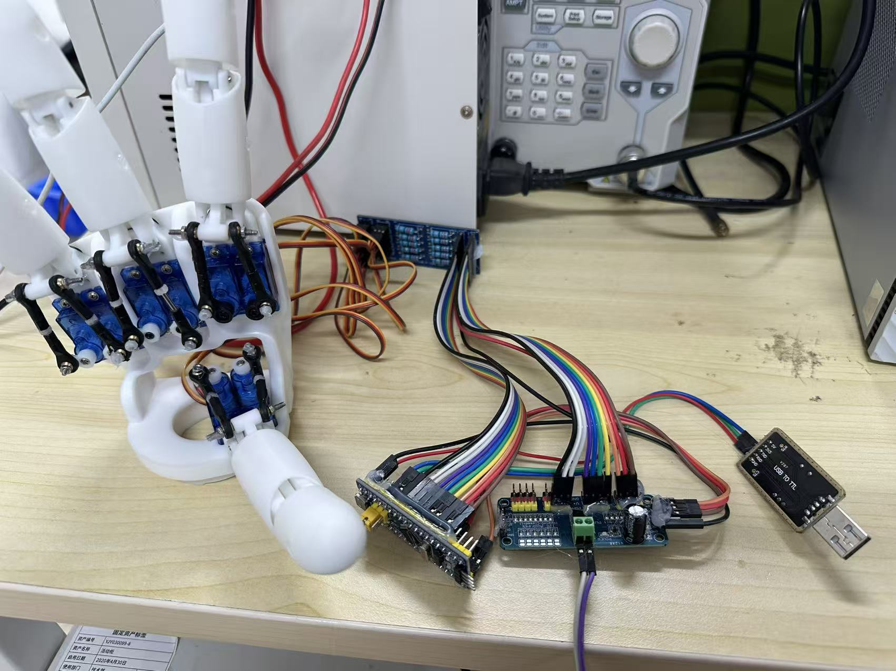
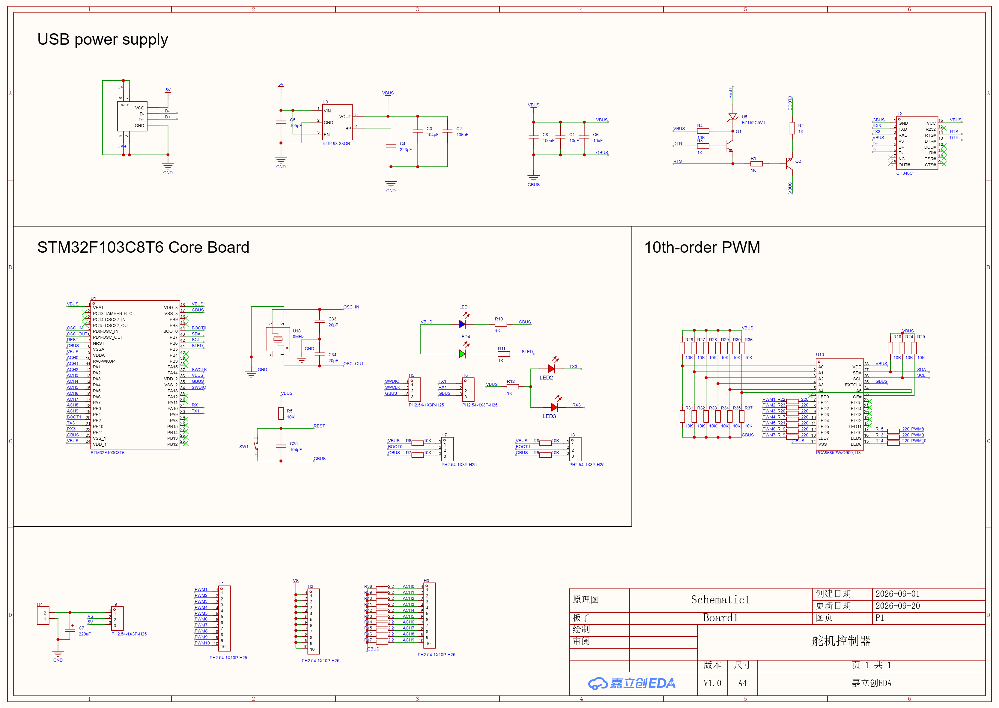

<div align="center">

**English** | [简体中文](README_zh-CN.md)

</div>

# HandBridge-SG90

An open-source controller and protocol bridge for replacing [AmazingHand](https://github.com/pollen-robotics/AmazingHand) servos with SG90 servos.

This project replaces the original AmazingHand servos with standard **SG90 180-degree servos**. A custom controller PCB built around the **STM32F103C8T6 and PCA9685** preserves the host-side serial protocol and converts position, speed, and time commands into servo PWM signals.

> This is an independent community compatibility project. It is not officially affiliated with or endorsed by the AmazingHand authors or any related manufacturer. AmazingHand and related names belong to their respective owners.

<p align="center">
  
</p>

<p align="center"><em>Working prototype with SG90 servos and the custom controller hardware.</em></p>

## Features

- Compatible with the AmazingHand-style serial frame beginning with `0xFF 0xFF`
- Supports servo IDs `1` through `10`
- Supports Ping, Read, Write, and Sync Write commands
- Maps target positions from `0–1023` to `180–0°` for SG90 servos
- Supports movement based on target time or target speed
- Generates 50 Hz PWM through a PCA9685, with up to 16 hardware channels
- Provides EEPROM/SRAM-style virtual registers for host compatibility
- Supports ten ADC inputs for optional servo-presence detection
- Uses USART1 for debug logs and USART3 for the control protocol
- Includes a custom four-layer controller PCB and production-ready manufacturing files

## How It Works

```text
AmazingHand host / controller
            │
            │ UART, 1 Mbps
            ▼
      Custom controller PCB
      ├─ STM32F103C8T6 protocol conversion
      ├─ CH340C USB-to-UART interface
      ├─ Virtual registers and ADC detection
      └─ PCA9685 PWM generation
            │
            │ I²C
            ▼
          PCA9685
            │
            │ 50 Hz PWM
            ▼
        Up to 10 SG90 servos
```

The firmware converts a received target position using:

```text
SG90 angle = 180 - target position × 180 / 1023
```

The PCA9685 uses the default address `0x40` and runs at `50 Hz`. The current pulse-count calibration is:

- 0°: `102`
- 180°: `512`
- Safety clamp: `80–550`

Mechanical travel varies between SG90 manufacturers and batches. For the first power-on test, remove the servo horn or reduce the configured travel. Verify direction and end stops before connecting the mechanical assembly.

## Hardware Requirements

- The custom controller PCB included in `Docs/PCB`, or an equivalent STM32F103C8T6 + PCA9685 circuit
- Up to ten SG90 servos
- Stable external 5 V servo power supply
- ST-Link programmer/debugger
- USB cable for the onboard CH340C serial interface
- Optional external USB-to-UART adapter for the control port
- Optional servo-presence detection circuit

## Wiring

The supplied PCB integrates the STM32F103C8T6, CH340C, 3.3 V regulator, PCA9685, status LEDs, SWD connector, UART headers, ten PWM outputs, and ten ADC detection inputs. The tables below describe the firmware-level connections and are also useful when building the circuit from modules.

### STM32 to PCA9685

| STM32F103C8T6 | PCA9685 | Description |
| --- | --- | --- |
| PB6 | SCL | I²C1 clock |
| PB7 | SDA | I²C1 data |
| 3.3V | VCC | PCA9685 logic supply |
| GND | GND | Common ground |
| External 5V | V+ | SG90 power supply |

### UART Connections

| Interface | Pins | Configuration | Purpose |
| --- | --- | --- | --- |
| USART1 TX/RX | PA9 / PA10 | 115200, 8N1 | Debug output |
| USART3 TX/RX | PB10 / PB11 | 1000000, 8N1 | AmazingHand control protocol |

Cross-connect TX and RX and make sure both devices share a common ground. The STM32F103 UART uses 3.3 V logic; do not connect it directly to RS-232 voltage levels.

The onboard CH340C is connected to USART1 for firmware logs and development. The AmazingHand protocol is handled by USART3 on PB10/PB11.

### Servo Channels

The firmware currently uses the servo ID directly as the PCA9685 channel number:

| Servo ID | PCA9685 channel |
| --- | --- |
| 1–10 | CH1–CH10 |

`CH0` is therefore unused. A common SG90 wire convention is brown for GND, red for 5 V, and orange for PWM. Check the documentation for your specific servo before connecting it.

### ADC Presence Detection

Servo IDs `1–10` are mapped to these ADC inputs:

| Servo ID | ADC input | MCU pin |
| --- | --- | --- |
| 1 | ADC1_IN0 | PA0 |
| 2 | ADC1_IN1 | PA1 |
| 3 | ADC1_IN2 | PA2 |
| 4 | ADC1_IN3 | PA3 |
| 5 | ADC1_IN4 | PA4 |
| 6 | ADC1_IN5 | PA5 |
| 7 | ADC1_IN6 | PA6 |
| 8 | ADC1_IN7 | PA7 |
| 9 | ADC1_IN8 | PB0 |
| 10 | ADC1_IN9 | PB1 |

The current presence threshold is approximately `8–250 mV`. Standard SG90 servos normally do not expose position feedback, so this feature requires the detection hardware designed for this project. Without that circuit, Ping and Read commands may not return a response. Adapt `s_get_servo()` in `Business/control/control.c` to match your hardware, or disable the check if appropriate.

## Custom Controller PCB

<p align="center">
  <a href="Docs/PCB/SCH_Schematic1_1-P1_2026-09-20.png">
    
  </a>
</p>

The included controller board integrates the complete conversion hardware:

- STM32F103C8T6 running at 72 MHz with an 8 MHz crystal
- PCA9685 16-channel PWM controller, with ten channels routed for the hand
- CH340C USB-to-UART interface with an automatic reset circuit
- RT9193-33GB 3.3 V regulator and USB logic power input
- Ten PWM outputs and ten current/voltage detection inputs
- SWD programming, UART, BOOT0, reset, and status LED interfaces
- Separate servo-power input with a 220 µF bulk capacitor

The manufacturing package contains a four-layer Gerber archive, BOM, and pick-and-place file. The current BOM has 29 line items and 81 total components, including 72 SMD placements and 9 through-hole placements.

| File | Purpose |
| --- | --- |
| [Schematic](Docs/PCB/SCH_Schematic1_1-P1_2026-09-20.png) | Complete controller schematic |
| [Gerber package](Docs/PCB/Gerber_PCB1_2026-09-20.zip) | PCB fabrication files, including copper, mask, silkscreen, outline, and drill data |
| [Bill of materials](Docs/PCB/BOM_Board1_PCB1_2026-09-20.xlsx) | Component values, footprints, designators, and available supplier part numbers |
| [Pick-and-place](Docs/PCB/PickAndPlace_PCB1_2026_09_20.xlsx) | SMT assembly coordinates, layers, and rotations |

Review the schematic, footprints, polarity, connector order, and manufacturer design rules before ordering. The supplied files represent the current prototype revision and are provided without manufacturing warranty.

## Power Warning

Do not power multiple SG90 servos from the STM32 development board, its USB connector, or a small onboard 5 V regulator.

- SG90 servos can draw high transient current during startup and stall
- Use a separate 5 V supply with sufficient current capacity
- Connect the grounds of the STM32, PCA9685, servo supply, and controller together
- Add a suitable bulk electrolytic capacitor close to PCA9685 V+ and GND
- Begin testing with one servo and avoid mechanical stalls

The required current for ten servos depends on load, movement pattern, and servo quality. Leave adequate power-supply headroom.

## Development Environment

- MCU: STM32F103C8T6
- CPU frequency: 72 MHz
- Framework: STM32F1 HAL Driver
- Configuration tool: STM32CubeMX
- IDE/project format: Keil MDK-ARM 5
- PCB design/export tool: EasyEDA/JLCEDA
- CubeMX project: `Servo_Protocol_Conversion.ioc`
- Keil project: `MDK-ARM/Servo_Protocol_Conversion.uvprojx`

## Build and Flash

1. Install Keil MDK-ARM 5 and the STM32F1 Device Family Pack.
2. Open `MDK-ARM/Servo_Protocol_Conversion.uvprojx`.
3. Select the `Servo_Protocol_Conversion` target and build the project.
4. Flash the STM32F103C8T6 using an ST-Link.
5. After startup, initialization and communication logs are available through USART1.

The repository also contains a generated firmware image:

```text
MDK-ARM/Servo_Protocol_Conversion/Servo_Protocol_Conversion.hex
```

> Before flashing the prebuilt HEX file, verify that your MCU, oscillator, pinout, and peripheral hardware match this project.

## Protocol Overview

Basic frame format:

```text
FF FF ID LENGTH COMMAND/ERROR PARAM... CHECKSUM
```

Checksum calculation:

```text
CHECKSUM = ~(ID + LENGTH + COMMAND/ERROR + PARAM...) & 0xFF
```

The firmware accepts IDs `1–10` and uses `0xFE` as the broadcast ID.

| Command | Code | Description |
| --- | --- | --- |
| Ping | `0x01` | Check whether a servo is present |
| Read | `0x02` | Read virtual registers |
| Write | `0x03` | Write virtual registers and control a servo |
| Sync Write | `0x83` | Control multiple servos in one frame |

Main motion registers:

| Address | Name |
| --- | --- |
| `0x2A–0x2B` | Goal position |
| `0x2C–0x2D` | Goal time |
| `0x2E–0x2F` | Goal speed |
| `0x38–0x39` | Current position |
| `0x3A–0x3B` | Current speed |

Movement behavior:

- Target speed `0`: set the target angle immediately
- Target time greater than `0`: move one degree at a time over the requested duration
- Target time `0` and target speed greater than `0`: move one degree at a time using the speed-derived delay
- ID `0xFE`: broadcast a write to IDs 1 through 10

## Repository Structure

```text
.
├─ Business/
│  ├─ control/           # Protocol-to-servo conversion logic
│  ├─ message_process/   # UART receiver, frame parser, and circular buffer
│  └─ register/          # Protocol-compatible virtual registers
├─ Core/                 # STM32CubeMX-generated initialization and main code
├─ Drivers/              # STM32 HAL and CMSIS
├─ Functional/
│  ├─ servo/             # PCA9685 and SG90 driver
│  └─ eeprom/            # External flash driver, currently unused by main flow
├─ Docs/
│  ├─ myhand.jpg         # Working prototype photo
│  └─ PCB/               # Schematic, Gerber, BOM, and pick-and-place files
├─ MDK-ARM/              # Keil project and build output
├─ README.md             # English documentation
├─ README_zh-CN.md       # Simplified Chinese documentation
└─ Servo_Protocol_Conversion.ioc
```

## Current Limitations

- The firmware runs bare-metal and does not use an RTOS
- Only the STM32F103C8T6, PCA9685, and SG90 combination has been tested
- Position direction is fixed to `1023 → 0°` and `0 → 180°`
- Smooth motion uses blocking delays, so one moving servo can temporarily block command processing
- Virtual registers are stored in RAM and reset to defaults after a reboot
- ADC presence detection requires additional hardware and is not SG90 position feedback
- SG90 accuracy, deadband, speed, and torque differ from the original AmazingHand servos, so behavior will not be identical

## Configuration

Commonly adjusted parameters are located in:

- `Functional/servo/pca9685.c`
  - PCA9685 I²C address
  - PWM frequency
  - 0°/180° pulse calibration and safety limits
- `Business/control/control.c`
  - Position-to-angle mapping direction
  - Speed and time movement algorithms
  - ADC presence thresholds
- `Core/Src/usart.c`
  - Control and debug UART baud rates

Before increasing mechanical travel, make sure the servo cannot drive the mechanism into a hard stop.

## Contributing

Issues and pull requests are welcome. Useful contributions include:

- Non-blocking coordinated multi-servo motion
- Per-servo direction, center offset, and travel calibration
- Improved protocol compatibility and malformed-frame handling
- Schematics, PCB files, wiring diagrams, and hardware demonstrations
- GCC/CMake or PlatformIO build support

## License

HandBridge-SG90 is released under the [MIT License](LICENSE).

STM32 HAL, CMSIS, and other third-party components remain subject to the licenses included in their respective directories.

## Acknowledgements

- The [AmazingHand](https://github.com/pollen-robotics/AmazingHand) project and community
- STMicroelectronics STM32 HAL and CMSIS
- Open-source PCA9685 and SG90 documentation and community projects
